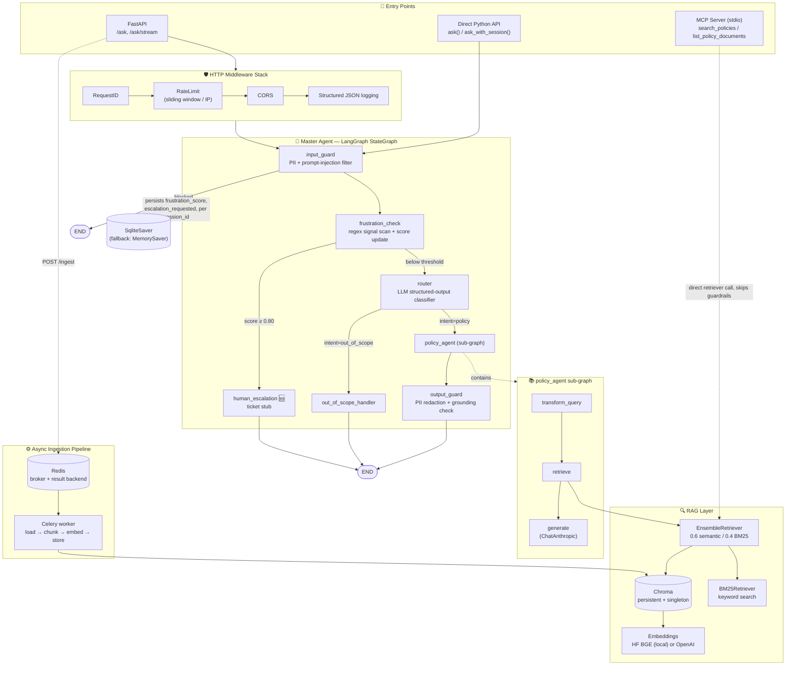
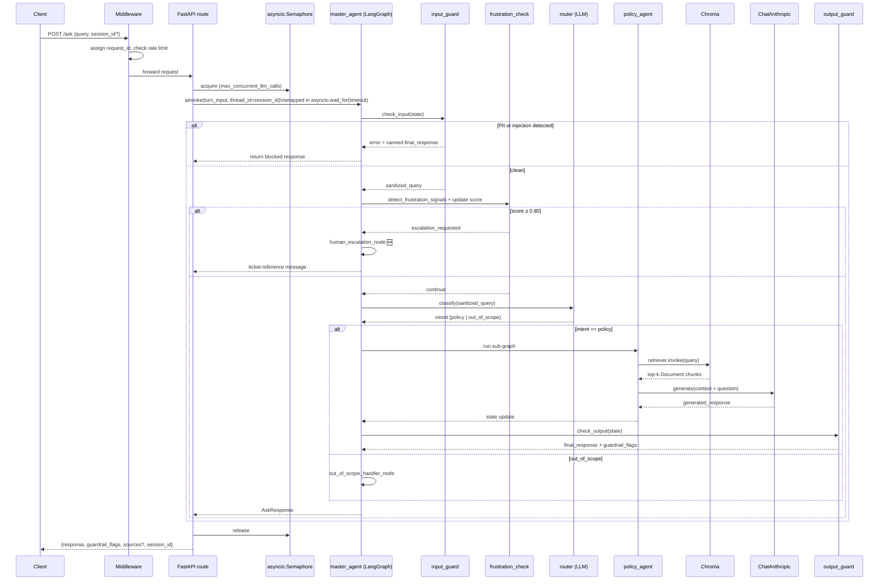
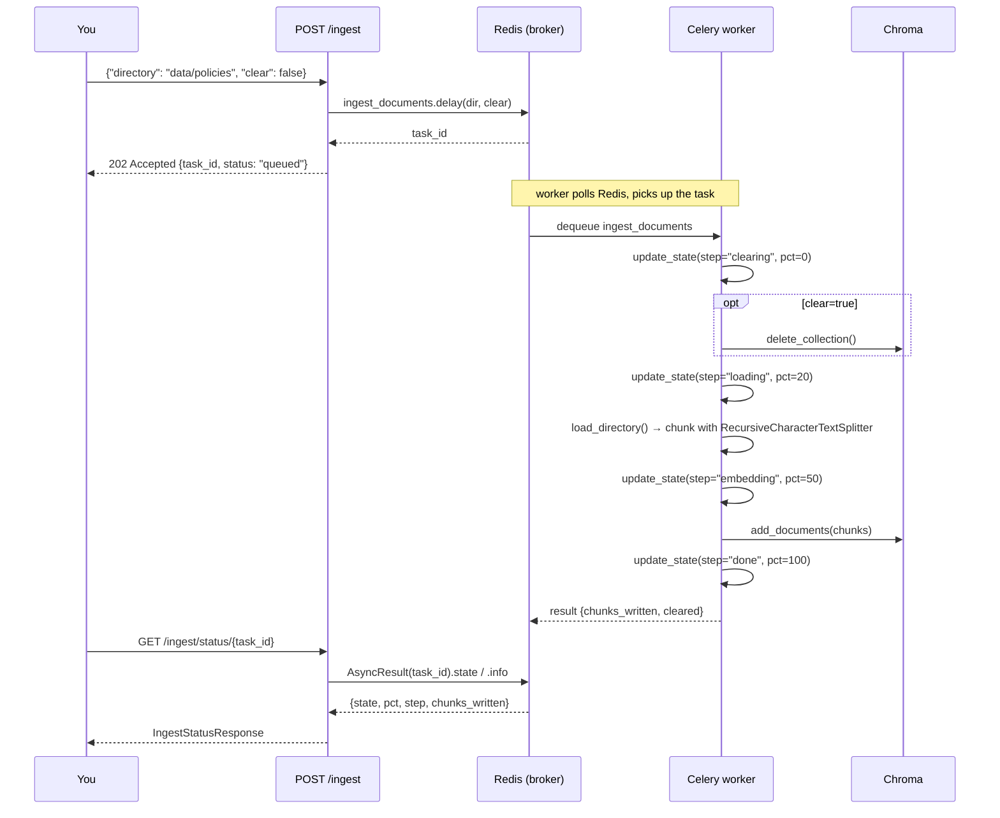
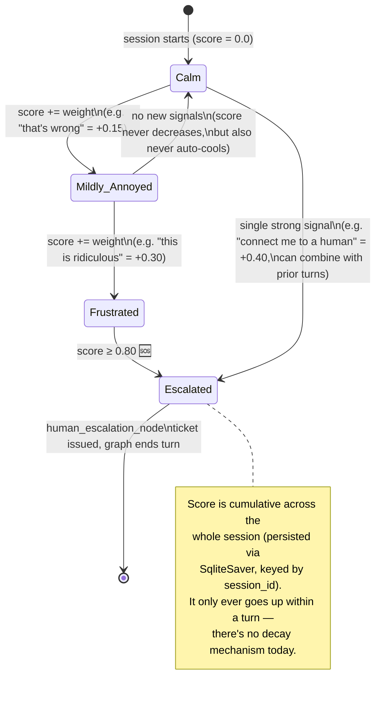
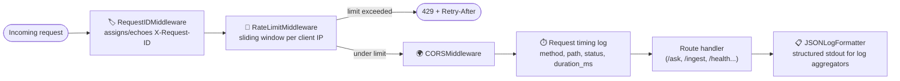
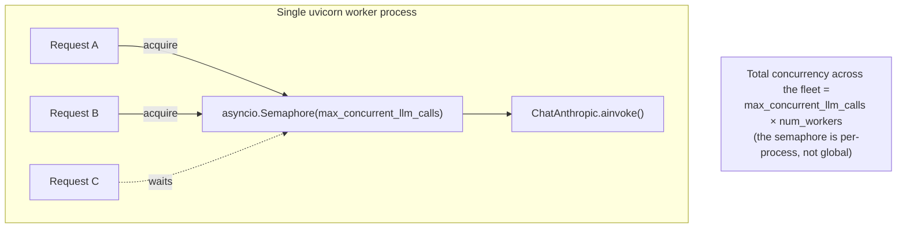

<div align="center">

# 🧠 ragent

### *A guardrail-first policy assistant that knows when to give up and call a human* 🙋‍♂️

*Multi-turn LangGraph agent · hybrid RAG · frustration-aware escalation · async ingestion pipeline*


</div>

---

## 👋 What even is this thing?

`ragent` answers "what does the policy say about X?" questions over your own PDFs/DOCX policy docs — but it's built around two questions most weekend-project RAG bots don't bother asking:

1. 🧯 **"Is the model actually making this up?"** → input/output guardrails + a lexical grounding check + an LLM judge + RAGAS, so hallucinations get caught instead of shipped.
2. 😤 **"Is the user about to lose their mind?"** → a cumulative, regex-scored frustration meter that auto-escalates to a human the moment things cross a threshold — no vibes-based LLM judgment call required.

It's exposed three ways off the *same* agent graph:

| Surface | Use it for |
|---|---|
| 🌐 **FastAPI** (`/api/v1/ask`, `/ask/stream`, `/ingest`) | Talking to it over HTTP, streaming tokens via SSE |
| 🔌 **MCP server** (`src/mcp_server.py`) | Plugging policy search into Claude Desktop or any MCP client |
| 🐍 **Direct Python** (`ask()`, `ask_with_session()`) | Embedding the agent straight into another service |

Built as a personal deep-dive into LangGraph state machines, hybrid retrieval, and "what does production-grade actually require" — so expect a few 🚧 rough edges alongside the parts that are genuinely solid.

---

## 🗺️ Table of Contents

- [🏗️ Architecture](#️-architecture)
- [🔁 Diagram Zoo (learning reference)](#-diagram-zoo-learning-reference)
  - [Request lifecycle — sync `/ask`](#1-request-lifecycle--sync-ask)
  - [Async ingestion via Celery + Redis](#2-async-ingestion-via-celery--redis)
  - [Frustration score state machine](#3-frustration-score-state-machine)
  - [Middleware pipeline](#4-middleware-pipeline)
- [🧰 Tech Stack & Why](#-tech-stack--why)
- [💡 Core Design Decisions](#-core-design-decisions)
- [📁 Module Map](#-module-map)
- [⚙️ Configuration Reference](#️-configuration-reference)

---

## 🏗️ Architecture




---

## 🔁 Design Zoo

A handful of extra diagrams purely so future-me (or anyone poking around this repo) can see *how* each moving part behaves, not just that it exists.

### 1. Request lifecycle — sync `/ask`



The **streaming** twin (`/ask/stream`) runs the identical graph via `astream_events(..., version="v2")`, filters for `on_chat_model_stream` events scoped to the `generate` node only (so router/judge tokens never leak to the client), and emits SSE with a final `done: true` frame.

### 2. Async ingestion via Celery + Redis

Swapped `BackgroundTasks` for a real queue. 🎉



**Why this over `BackgroundTasks`:** crash-safe redelivery (`task_acks_late=True`), automatic retry with exponential backoff on transient I/O errors, real progress percentages instead of "check the logs," and the ability to add more worker processes without touching the API process at all.

### 3. Frustration score state machine

The escalation logic, drawn as what it actually is — a one-way ratchet with a trapdoor. 😅



### 4. Middleware pipeline

Every request runs this gauntlet before it ever touches the agent graph:



### 5. Concurrency control — the semaphore dance

Per-worker throttling so one uvicorn process doesn't fire 200 concurrent LLM calls at Anthropic:



---

## 🧰 Tech Stack & Why

| Layer | Choice | Why 🤔 |
|---|---|---|
| **Orchestration** | LangGraph `StateGraph` | Explicit, inspectable state machine instead of an implicit agent loop — routing/escalation logic is testable as plain functions independent of any LLM call. |
| **LLM** | Claude via `langchain-anthropic` | One provider client reused for generation, routing, scope detection, and judging — swappable per-node by model name. |
| **Web framework** | FastAPI + Uvicorn | Native async matches LangGraph's async invocation path; free OpenAPI docs at `/docs`; first-class SSE for token streaming. |
| **Vector store** | Chroma, singleton + threading lock | Zero-ops embedded vector DB; singleton avoids N embedding-model loads and SQLite "database is locked" errors under concurrent requests. |
| **Embeddings** | HuggingFace BGE (`all-MiniLM-L6-v2`) locally, OpenAI opt-in | Local by default = no second paid API + no extra network hop on every retrieval. |
| **Keyword retrieval** | `rank-bm25` + custom `BM25Retriever` | Lexical fallback for exact-term queries dense embeddings under-rank. |
| **Hybrid fusion** | `EnsembleRetriever`, weights `[0.6, 0.4]` | RRF-style fusion of semantic + keyword without hand-rolling it. |
| **Doc parsing** | `unstructured[pdf,docx]` | Handles messy real-world PDFs/DOCX (tables, headers) better than naive text extraction. |
| **Chunking** | `RecursiveCharacterTextSplitter` | Splits on paragraph → line → sentence → word, preserving semantic units. |
| **Structured LLM output** | Pydantic + `.with_structured_output()` | Router intent, scope decision, judge scores are typed models — no hand-parsed JSON. |
| **Multi-turn state** | `SqliteSaver` checkpointer (fallback `MemorySaver`), keyed by `thread_id=session_id` | Frustration score + escalation flag survive a server restart now. |
| **Async task queue** | Celery + Redis | Crash-safe, retryable, horizontally-scalable ingestion — see the [ingestion diagram](#2-async-ingestion-via-celery--redis). |
| **CLI** | Typer + Rich | `ingest --file/-f` or `--dir/-d`, with `--dry-run` and a pretty summary table — nicer than raw `argparse` prints. |
| **Frustration detection** | Hand-written weighted regex bank, no LLM call | Deterministic, sub-millisecond, zero-cost per turn — this signal gates on *every single message*, so an LLM call here would be wasteful. |
| **Evaluation** | Custom LLM-judge + RAGAS | Two independent eval paths for faithfulness/relevance/completeness/hallucination and standardized retrieval metrics. |
| **Observability** | LangSmith (opt-in) + structured JSON logs + request IDs | Tracing when you want it, greppable/aggregatable logs always. |
| **Rate limiting** | In-memory sliding-window middleware | Simple per-process throttle; documented TODO to move to Redis `INCR` so multi-worker deployments share one limit. |
| **Tool exposure** | MCP server (stdio) | Any MCP client (Claude Desktop, etc.) can call `search_policies`/`list_policy_documents` directly — deliberately narrower than the guarded HTTP path. |
| **Packaging** | `pyproject.toml` optional-dependency groups (`api`, `mcp`, `eval`, `openai`, `dev`) | Install only what you need. |
| **Linting/typing** | `ruff` + `mypy --strict` | Fast lint/import-sort + strict typing on a `TypedDict`-heavy state model. |

---

## 💡 Core Design Decisions

### 🛡️ Guardrails live *in* the graph, not in HTTP middleware
`input_guard` and `output_guard` are LangGraph nodes, so the same checks apply whether you hit the agent over HTTP, embed it directly in Python, or (partially) via MCP. Trade-off: a blocked request still costs one node execution — there's no free "reject before graph starts" path.

### 😤 Frustration is cumulative and one-directional
`update_frustration_score()` never subtracts — once you're annoyed, the score only climbs within the session (see the [state machine](#3-frustration-score-state-machine)). Crossing `ESCALATION_THRESHOLD = 0.80` routes to `human_escalation_node` **regardless of what the router would've decided** — a deterministic, regex-computed circuit breaker sitting on top of an otherwise LLM-driven pipeline.

### 🧭 Structured routing that fails open
`router_node` classifies intent via `.with_structured_output(RouterDecision)`. If the router call throws, the code **defaults to `"policy"`** rather than failing the whole request — availability over strict scope enforcement, by explicit design.

### 🥈 Hybrid retrieval is opt-in
`build_retriever()` only builds the BM25 + semantic ensemble when `use_bm25=True` **and** a corpus is supplied. It's there and ready, but wiring a corpus into `retrieve_node` at call time is what flips it on.

### 🧵 Output grounding via cheap lexical overlap, not embeddings
`_is_grounded()` tokenizes retrieved context + generated response (words >4 chars), and flags low grounding if a >20-word response shares <3 words with the retrieved vocabulary. Deliberately lightweight — a full embedding-similarity check would cost an extra model call on *every* response.

### 📦 Celery + Redis over fire-and-forget background tasks
Documented directly in `ingest.py`'s docstring — the switch bought crash recovery, real status polling, automatic retry with backoff, horizontal scaling, and process isolation (the old approach shared the API's event loop; the new one runs in a totally separate worker process).

### 🔒 Chroma as a locked singleton
`get_vectorstore()` uses a double-checked lock so 20 concurrent requests share one Chroma client instead of spinning up 20 (20x the embedding-model RAM, 20 SQLite file handles, guaranteed "database is locked" errors).

### 🚦 Per-process semaphore + timeout around every LLM call
`/ask` acquires an `asyncio.Semaphore(max_concurrent_llm_calls)` before invoking the graph, wrapped in `asyncio.wait_for(agent_timeout_seconds)`. The semaphore is explicitly **per-worker-process** (documented in `dependencies.py`) — total fleet concurrency is `max_concurrent_llm_calls × num_workers`, so the per-worker value should be tuned against your actual Anthropic rate limit.

### 🩺 Two-tier health checking
`/health` is a pure liveness probe for pod-restart decisions. `/status` actually opens the Chroma collection and reports `degraded` (not a 5xx) if it can't — because the service can still limp along answering from parametric knowledge even with retrieval down.

### 🔌 MCP server as a narrower surface
`mcp_server.py` calls the retriever directly, skipping guardrails and frustration tracking entirely — MCP tools are meant to hand raw context to an *external* LLM's own reasoning loop, not re-expose the fully-guarded conversational agent.

---

## 📁 Module Map

```
ragent/
├── main.py                          # uvicorn entrypoint
├── scripts/
│   └── ingest_data.py                 # 🖥️  Typer CLI: --file/--dir, --clear, --dry-run, Rich summary table
└── src/
    ├── agents/
    │   ├── state.py                   # AgentState TypedDict — shared schema across every graph node
    │   ├── master_agent.py            # top-level StateGraph: guardrails, frustration, routing, escalation
    │   ├── policy_agent.py            # sub-graph: transform_query → retrieve → generate
    │   └── __init__.py
    ├── api/
    │   ├── app.py                      # FastAPI factory (lifespan, middleware wiring, routers)
    │   ├── middleware.py               # 🆕 RequestID, RateLimit (sliding window), JSON log formatter
    │   ├── dependencies.py             # verify_api_key, get_llm_semaphore, get_request_id
    │   ├── schema.py                   # Pydantic request/response models
    │   └── routes/
    │       ├── query.py                # POST /ask, POST /ask/stream (SSE) — semaphore + timeout wrapped
    │       ├── ingest.py                # POST /ingest (Celery), GET /ingest/status/{task_id}
    │       ├── ingest_bgtask.py         # 🗄️ archived: the old BackgroundTasks version, kept for reference
    │       └── health.py                # GET /health (liveness), GET /status (readiness)
    ├── worker/
    │   ├── celery_app.py                # 🆕 Celery config: JSON serialization, late acks, single-prefetch
    │   └── tasks.py                     # 🆕 ingest_documents task — retry w/ backoff, progress reporting
    ├── guardrails/
    │   ├── input_guard.py                # PII (CC/SSN) + prompt-injection regex filter
    │   ├── output_guard.py               # PII redaction + lexical grounding heuristic
    │   ├── frustration_detector.py       # weighted regex signal bank + cumulative score
    │   └── scope_detector.py             # standalone LLM in/out-of-scope classifier
    ├── rag/
    │   ├── document_processor.py         # UnstructuredFileLoader + RecursiveCharacterTextSplitter
    │   ├── embeddings.py                  # local (HF BGE) or OpenAI embedding provider, lru_cached
    │   ├── vectorstore.py                 # 🆕 Chroma singleton (thread-locked) + retriever factory
    │   └── retriver.py                    # BM25Retriever + EnsembleRetriever hybrid builder
    ├── evaluation/
    │   ├── judge_llm.py                   # structured-output LLM judge: 4-dimension scoring
    │   └── ragas_eval.py                   # RAGAS harness (faithfulness, answer relevance, context precision)
    ├── observability/
    │   └── tracing.py                      # LangSmith env-var setup, run URL builder
    ├── mcp_server.py                        # stdio MCP server: search_policies, list_policy_documents
    └── config/
        └── settings.py                      # pydantic-settings, .env-backed
```

---

## ⚙️ Configuration Reference

All settings load via `pydantic-settings` from environment variables / a `.env` file (case-insensitive).

| Setting | Default | Notes |
|---|---|---|
| `anthropic_api_key` | `""` | Required for any LLM call to succeed |
| `llm_model` | `claude-opus-4-8` | Shared across generation, routing, scope detection, judging |
| `llm_max_tokens` / `llm_temperature` | `4096` / `0.1` | Low temperature favors grounded answers over creativity |
| `embedding_provider` / `embedding_model` | `local` / `all-MiniLM-L6-v2` | `local` (HF BGE, CPU) or `openai` |
| `chroma_presist_dir` / `chroma_collection_name` | `./data/chroma-db` / `policies` | Persistent vector store location |
| `retriver_top_k` | `6` | Top-k for retrieval |
| `use_bm25` | `False` | Enables hybrid retrieval once a corpus is wired in |
| `chunk_size` / `chunk_overlap` | `100` / `200` | Splitter config |
| `langsmith_api_key` / `langsmith_project` / `langsmith_tracing` | — / `ragent` / `False` | `langsmith_enabled` gates on both key + flag |
| `redis_url` | `redis://localhost:6317` | 🆕 Celery broker + result backend |
| `max_concurrent_llm_calls` | `10` | 🆕 Per-worker semaphore size |
| `agent_timeout_seconds` | `60` | 🆕 Hard timeout around `master_agent.ainvoke()` |
| `rate_limit_per_minute` | `60` | 🆕 Sliding-window limit per client IP |
| `cors_origin` | `["*"]` | 🆕 CORS allow-list |
| `api_secret_key` | `""` | 🆕 Bearer token for `verify_api_key` — unset = auth disabled |

---

<div align="center">

*Built as a hands-on exploration of guardrail-first agent design — issues, PRs, and "hey this regex is wrong" comments welcome.* ✨

</div>
