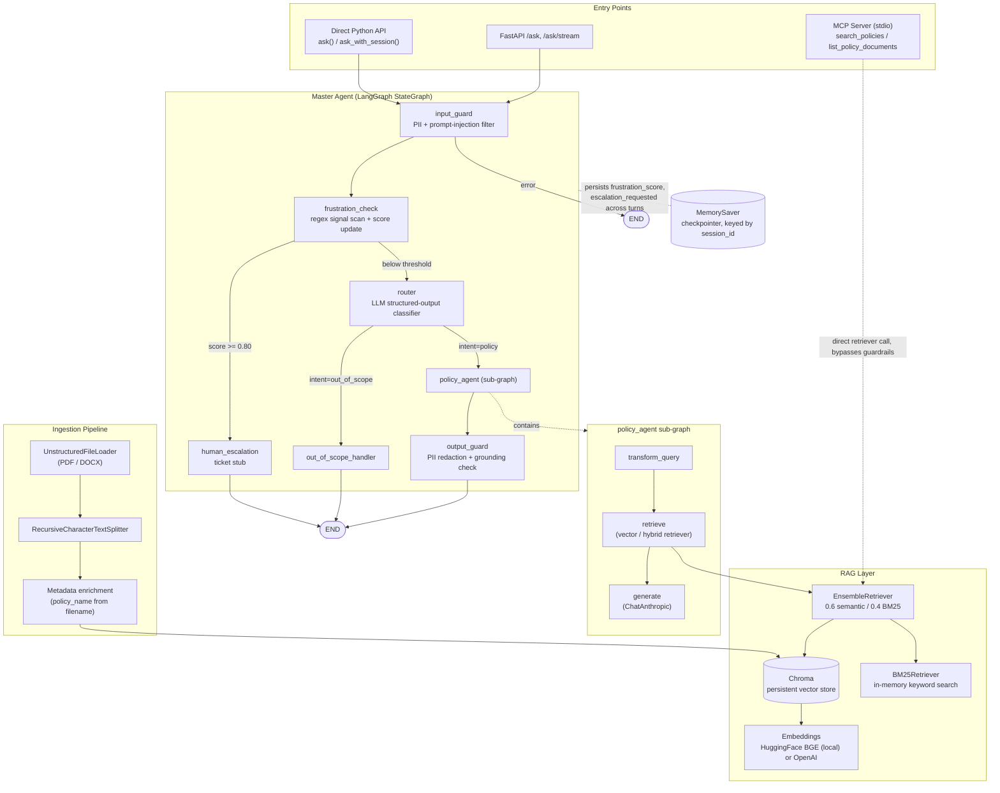
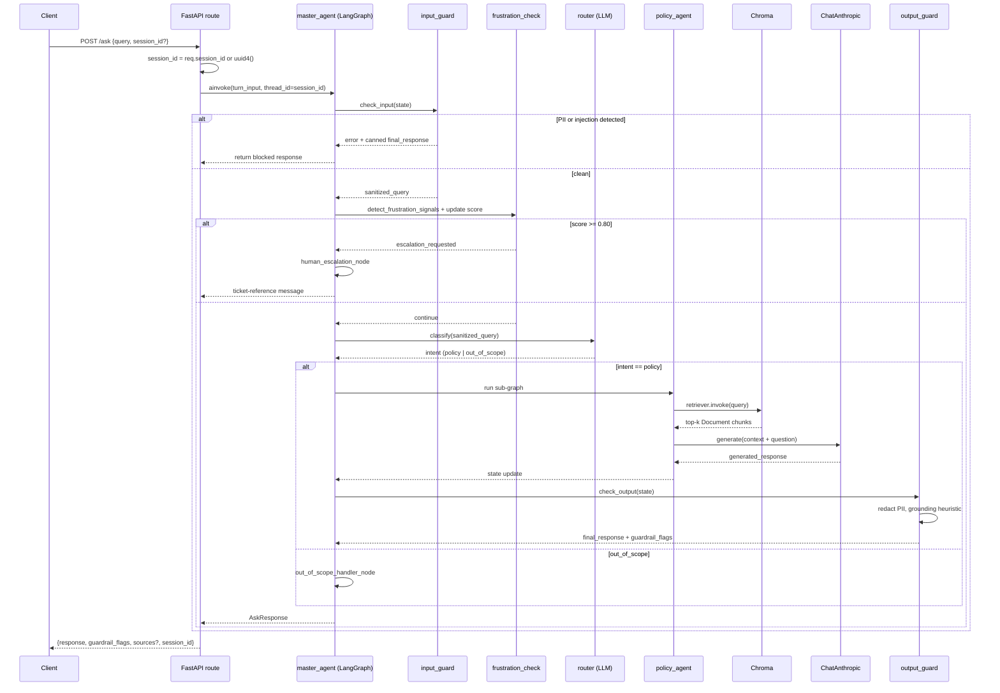

# ragent

> Guardrail-first policy assistant with frustration-aware escalation. A multi-turn conversational agent built on LangGraph, with LLM-based intent routing, hybrid retrieval, and a regex-driven escalation model.

## 1. Purpose & Problem Statement

`ragent` answers employee questions about internal policy documents (HR policy, expense policy, leave policy, etc.) using retrieval-augmented generation, while treating two failure modes as first-class design concerns rather than afterthoughts:

1. **Hallucination / ungrounded answers** — mitigated with input/output guardrails and a lexical grounding check, plus an offline LLM-judge and RAGAS evaluation harness.
2. **User frustration in multi-turn conversations** — tracked as a cumulative, session-scoped score and used to trigger automatic human escalation, rather than relying on the LLM to "notice" frustration.

The system is exposed three ways from the same core agent graph:
- A **FastAPI** service (`/api/v1/ask`, `/api/v1/ask/stream`, `/api/v1/ingest`, `/api/v1/health`, `/api/v1/status`)
- An **MCP server** (`src/mcp_server.py`) exposing `search_policies` and `list_policy_documents` as tools for external LLM clients
- A **direct Python API** (`ask`, `ask_with_session`) for embedding the agent in other services

---

## 2. High-Level Architecture



---

## 3. Request Lifecycle (single turn, synchronous `/ask`)



The **streaming** variant (`/ask/stream`) runs the identical graph but consumes `master_agent.astream_events(..., version="v2")`, filters for `on_chat_model_stream` events scoped to the `generate` LangGraph node (so router/judge token noise is not leaked to the client), and emits Server-Sent Events. A final `done: true` event carries `guardrail_flags`, `sources`, and `session_id`.

---

## 4. Tech Stack & Rationale

| Layer | Choice | Why |
|---|---|---|
| **Orchestration** | LangGraph (`StateGraph`) | Explicit, inspectable state machine over implicit agent loops. Conditional edges make routing/escalation logic testable as pure functions (`_route_after_*`) independent of LLM calls. |
| **LLM** | Anthropic Claude via `langchain-anthropic` | Single-provider `ChatAnthropic` client reused across generation, routing, scope detection, and judging — swappable per-node by model name (comment in `master_agent.py` notes intent to swap a cheaper model in for routing). |
| **Web framework** | FastAPI + Uvicorn | Native `async`/`await` matches LangGraph's async invocation path; built-in OpenAPI docs (`/docs`); first-class SSE support via `StreamingResponse` for token streaming. |
| **Vector store** | Chroma (`langchain-chroma`), persisted to disk | Zero-ops embedded vector DB — no external service dependency for a project this size; persists to `./data/chroma-db` so ingestion survives restarts. |
| **Embeddings** | `sentence-transformers` / HuggingFace BGE (`all-MiniLM-L6-v2`) by default, OpenAI as opt-in | Local embeddings avoid a second paid API dependency and external network call on every retrieval; `EMBEDDING_PROVIDER=openai` is a config flip for teams that want higher-quality embeddings. |
| **Keyword retrieval** | `rank-bm25` + custom `BM25Retriever` | Lexical fallback for exact-term queries (policy numbers, specific clause names) that dense embeddings under-rank; combined via `EnsembleRetriever`. |
| **Hybrid fusion** | `EnsembleRetriever` (LangChain), weights `[0.6, 0.4]` | Reciprocal-rank-style fusion of semantic + keyword results without hand-rolling RRF; weighting favors semantic recall while keeping lexical precision as a corrective. |
| **Doc parsing** | `unstructured[pdf,docx]` via `UnstructuredFileLoader` | Handles messy real-world policy PDFs/DOCX (tables, headers) better than naive text extraction. |
| **Chunking** | `RecursiveCharacterTextSplitter` | Splits on paragraph → line → sentence → word boundaries in priority order, preserving semantic units better than fixed-width slicing. |
| **Structured LLM outputs** | `pydantic` + `.with_structured_output()` | Router intent, scope decision, and judge scores are all typed Pydantic models — guarantees parseable output instead of prompting for JSON and hand-parsing. |
| **Multi-turn state** | LangGraph `MemorySaver` checkpointer, keyed by `thread_id = session_id` | Frustration score and escalation flag persist across turns without a hand-built session store; swappable for a Redis/Postgres checkpointer later (noted as a TODO). |
| **Frustration detection** | Hand-written regex bank, not an LLM call | Deterministic, sub-millisecond, zero-cost per turn — appropriate for a signal that gates on every single message. An LLM classifier here would add latency and cost to every turn for a binary-ish signal that pattern-matches well. |
| **Evaluation** | Custom LLM-judge (`judge_llm.py`) + RAGAS (`ragas_eval.py`) | Two independent evaluation paths: a fast structured-output judge for faithfulness/relevance/completeness/hallucination, and RAGAS for standardized retrieval metrics (faithfulness, answer relevance, context precision) — useful for regression-testing retrieval quality independent of the judge's own prompt. |
| **Observability** | LangSmith (optional, `langsmith_enabled` flag) | Opt-in tracing of node execution, LLM calls, and retrieval latency without changing code paths when disabled. |
| **Tool exposure** | MCP server (`mcp` SDK, stdio transport) | Lets any MCP-compatible client (Claude Desktop, other agents) call `search_policies` / `list_policy_documents` directly against the retriever, bypassing the guardrail/frustration pipeline — a deliberate scope reduction, see §6. |
| **Package/dep management** | `pyproject.toml` with optional-dependency groups (`api`, `mcp`, `eval`, `openai`, `dev`) | Consumers only install what they need (e.g. a pure ingestion CLI doesn't need `fastapi`). |
| **Linting/typing** | `ruff` (E, F, I, UP rules) + `mypy --strict` | Fast lint + import-sort in one tool; strict typing on a codebase that leans heavily on `TypedDict` state makes key-typos (see §7) easier to catch — though evidently not all are caught yet. |

---

## 5. Core Design Decisions

### 5.1 Guardrails as graph nodes, not middleware
`input_guard` and `output_guard` are ordinary LangGraph nodes, not FastAPI middleware. This means:
- Guardrail checks apply identically whether the agent is invoked via HTTP, the MCP tool path (for the sub-parts it does traverse), or direct Python call.
- Guardrail state (flags, blocked reason) flows through the same `AgentState` as everything else, so a blocked turn still produces a well-formed response object instead of an HTTP-layer short-circuit.
- Trade-off: guardrail logic can't reject a request before any graph execution cost is paid — there's always at least one node invocation, even for a blocked query.

### 5.2 Frustration as a cumulative, weighted score
Rather than a single-turn "is this message angry?" classifier, `frustration_detector.py` treats frustration as **session-level state that only escalates within a turn, never regresses** (`update_frustration_score` floors at the current score, never subtracts). Signals are weighted by severity:

| Signal class | Weight | Example |
|---|---|---|
| Explicit human/agent request | 0.40 | "connect me to a human" |
| Strong negative emotion | 0.30–0.35 | "this is ridiculous", "I give up" |
| Confusion / repetition | 0.15 | "you don't understand", "same answer" |
| Short negative one-word | 0.10 | "wrong", "nope" |

Crossing `ESCALATION_THRESHOLD = 0.80` (cumulative, across the session, via the `MemorySaver` checkpointer) routes to `human_escalation_node` regardless of what the router would have decided. This is a **deterministic circuit breaker** layered on top of an otherwise LLM-driven pipeline — the score is regex-computed so it's auditable and doesn't depend on LLM availability.

### 5.3 Structured routing instead of free-text intent parsing
`router_node` uses `ChatAnthropic(...).with_structured_output(RouterDecision)` where `RouterDecision` is a two-field Pydantic model (`intent: Literal["policy","out_of_scope"]`, `reasoning: str`). On any router exception, the code **fails open to `"policy"`** rather than failing the request — the inline comment explicitly frames this as a "keep pipeline alive" decision. This favors availability over strict scope enforcement.

### 5.4 Hybrid retrieval is opt-in, not default
`build_retriever()` only constructs the BM25 + semantic ensemble when **both** `settings.use_bm25` is `True` **and** an in-memory `corpus` is supplied by the caller. In the current wiring, `retrieve_node` in `policy_agent.py` calls `build_retriever()` with no corpus argument, so **the hybrid path is effectively dead code in the running graph today** — it falls through to pure semantic retrieval every time. This is worth flagging explicitly (see §7) since it's a real gap between the advertised "hybrid retriever" design and current runtime behavior.

### 5.5 Output grounding via lexical overlap heuristic, not embeddings
`_is_grounded()` in `output_guard.py` is a cheap heuristic: it lowercases and tokenizes both the retrieved context and the generated response (words >4 chars only), and flags `OUTPUT_LOW_GROUND_SCORE` if the response is longer than 20 significant words but shares fewer than 3 with the retrieved vocabulary. This is intentionally lightweight — a full embedding-similarity or NLI-based grounding check would cost an extra model call on every response. The trade-off is a heuristic that can be fooled by paraphrase (semantically grounded but lexically divergent answers) and won't catch subtle factual drift within otherwise-overlapping vocabulary.

### 5.6 Fire-and-forget ingestion with `BackgroundTasks`
`/api/v1/ingest` returns `202 Accepted` immediately and runs loading → chunking → embedding → storing in a FastAPI `BackgroundTasks` callback, moved off the event loop via `asyncio.to_thread` for the CPU/IO-bound steps. The code comments explicitly note this is a stopgap ("will implement celery/arq + redis for task queue management") — acceptable for single-instance deployments but with no retry, progress-reporting, or multi-worker coordination.

### 5.7 Two-tier health checking (`/health` vs `/status`)
`/health` is a pure liveness probe (always `200 ok` if the process can respond at all) intended to gate **pod restarts** in Kubernetes. `/status` is a readiness probe that actually opens the Chroma collection and counts documents, returning `degraded` (not a 5xx) if the vector store is unreachable — intended to gate **traffic routing**, not restarts, since the service can still answer from LLM parametric knowledge (with zero retrieval grounding) even if Chroma is down.

### 5.8 MCP server as a narrower surface than the HTTP API
`mcp_server.py` exposes only `search_policies` (raw retriever call) and `list_policy_documents` (distinct `policy_name` values from Chroma metadata) — it calls `build_retriever()` directly and **does not** go through `master_agent`, so MCP clients get raw retrieval, not guardrail-checked, frustration-tracked, routed answers. This is a deliberate scope boundary: MCP tools are meant to hand context to an external LLM's own reasoning loop, not to re-expose the full guarded conversational agent.

### 5.9 Factory pattern for app construction
`create_app()` centralizes lifespan (LangSmith setup/teardown logging), CORS, a request-timing middleware (method/path/status/duration — poor-man's APM without extra infra), a global exception handler that maps any uncaught exception to a generic `500` (avoiding leaking stack traces to clients), and router registration under a single `/api/v1` prefix. Keeping this in a factory function (rather than module-level `app = FastAPI()`) keeps `main.py` a thin entrypoint and makes the app instantiable for tests without importing `uvicorn`.

---

## 6. Module Map

```
ragent/
├── main.py                      # uvicorn entrypoint
├── scripts/
│   └── ingest_data.py            # CLI entrypoint (registered as `ingest` script) — currently empty
└── src/
    ├── agents/
    │   ├── state.py              # AgentState TypedDict — shared schema across all graph nodes
    │   ├── master_agent.py       # top-level StateGraph: guardrails, frustration, routing, escalation
    │   ├── policy_agent.py       # sub-graph: transform_query -> retrieve -> generate
    │   └── __init__.py
    ├── api/
    │   ├── app.py                 # FastAPI factory (lifespan, middleware, routers, exception handling)
    │   ├── dependencies.py        # verify_api_key (Depends()-based auth stub)
    │   ├── schema.py              # Pydantic request/response models
    │   └── routes/
    │       ├── query.py           # POST /ask, POST /ask/stream (SSE)
    │       ├── ingest.py          # POST /ingest (background task)
    │       └── health.py          # GET /health (liveness), GET /status (readiness)
    ├── guardrails/
    │   ├── input_guard.py         # PII (CC/SSN) + prompt-injection regex filter
    │   ├── output_guard.py        # PII redaction + lexical grounding heuristic
    │   ├── frustration_detector.py# weighted regex signal bank + cumulative score
    │   └── scope_detector.py      # standalone LLM in/out-of-scope classifier (pre-graph filtering use case)
    ├── rag/
    │   ├── document_processor.py  # UnstructuredFileLoader + RecursiveCharacterTextSplitter + metadata enrichment
    │   ├── embeddings.py           # local (HF BGE) or OpenAI embedding provider, lru_cached
    │   ├── vectorstore.py          # Chroma client, add_documents, base retriever factory
    │   └── retriver.py             # BM25Retriever + EnsembleRetriever hybrid builder [sic — filename]
    ├── evaluation/
    │   ├── judge_llm.py            # structured-output LLM judge: faithfulness/relevance/completeness/hallucination
    │   └── ragas_eval.py           # RAGAS harness (faithfulness, answer relevance, context precision, [context recall])
    ├── observability/
    │   └── tracing.py              # LangSmith env-var setup, run URL builder
    ├── mcp_server.py                # stdio MCP server: search_policies, list_policy_documents
    └── config/
        └── settings.py              # pydantic-settings, .env-backed
```

---


## 7. Configuration Reference (`src/config/settings.py`)

All settings are loaded via `pydantic-settings` from environment variables / a `.env` file (case-insensitive).

| Setting | Default | Notes |
|---|---|---|
| `anthropic_api_key` | `""` | Required for any LLM call to succeed |
| `llm_model` | `claude-opus-4-8` | Shared across generation, routing, scope detection, judging |
| `llm_max_tokens` | `4096` | Generation cap |
| `llm_temperature` | `0.1` | Low temperature — favors deterministic, grounded answers over creativity |
| `embedding_provider` | `local` | `local` (HF BGE, CPU) or `openai` |
| `embedding_model` | `all-MiniLM-L6-v2` | Fast, small, CPU-friendly local model |
| `chroma_presist_dir` | `./data/chroma-db` | [sic] persistence path |
| `chroma_collection_name` | `policies` | |
| `retriver_top_k` | `6` | [sic] top-k for retrieval |
| `use_bm25` | `False` | See §5.4 / §7 — currently inert regardless of value |
| `chunk_size` / `chunk_overlap` | `100` / `200` | See §7 — likely misconfigured |
| `langsmith_api_key` / `langsmith_project` / `langsmith_tracing` | `""` / `ragent` / `False` | `langsmith_enabled` property gates on both key presence and the tracing flag |

---

## 9. Running Locally

```bash
# install core + api + mcp + eval extras
pip install -e ".[api,mcp,eval]"

# configure
cp .env.example .env   # set ANTHROPIC_API_KEY at minimum

# start the API (auto-reload dev mode, per main.py)
python main.py
# or, for multi-worker production-style run:
uvicorn main:app --host 0.0.0.0 --port 8000 --workers 4

# ingest policy documents (PDF/DOCX) from a directory
curl -X POST http://localhost:8000/api/v1/ingest \
  -H "Content-Type: application/json" \
  -d '{"directory": "data/policies", "clear": false}'

# ask a question
curl -X POST http://localhost:8000/api/v1/ask \
  -H "Content-Type: application/json" \
  -d '{"query": "What is the maximum reimbursable amount for business travel?", "include_sources": true}'
```

OpenAPI docs are served at `/docs` once the app is running.
